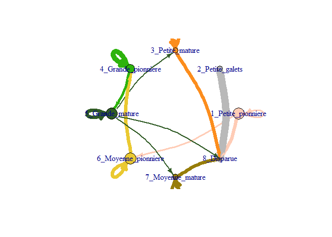
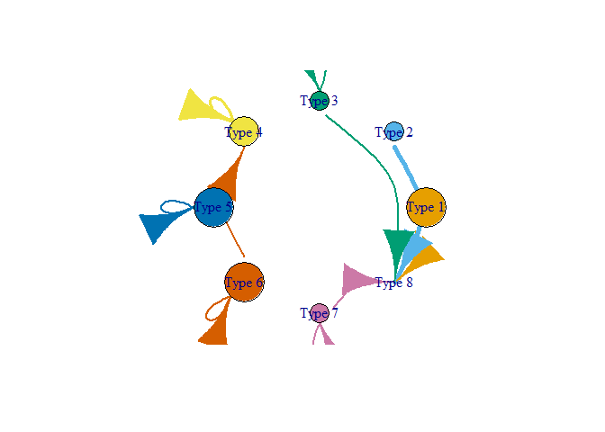
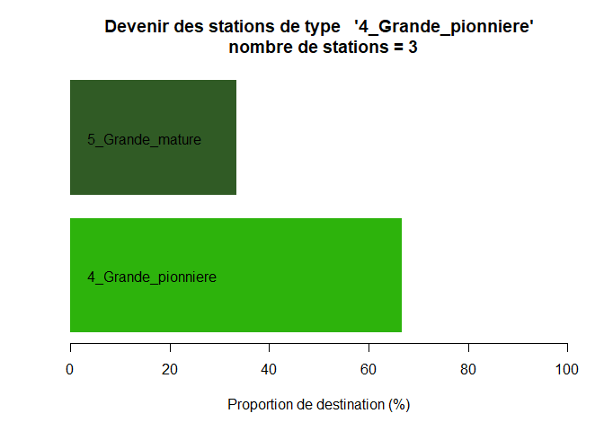
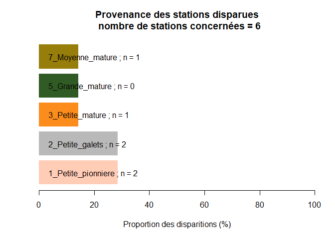
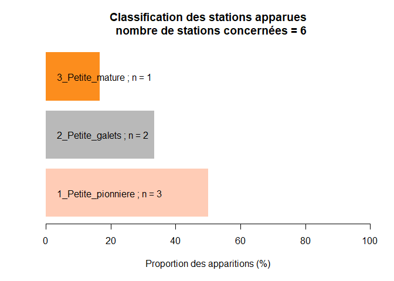

Ce tutoriel présente le package `TransiTypha` créé pour calculer et illustrer les "matrices de transitions" - ou "modèles d'états et transition" pour les différents états de *T. minima*.

Voici les différents états possibles que nous avons déterminés :


L'idée du package `TransiTypha` est, à partir d'une cartographie des taches et de renseignements sur les stations, d'attribuer automatiquement chaque tache à une catégorie, de calculer les probabilités de transition d'un état à un autre et d'illustrer par quelques graphiques synthétiques ces dynamiques.

## Méthodo :

La première étape est quand même sur le terrain, il faut une cartographie des taches et stations de *T. minima*, avec quelques informations sur chaque tache :

* la taille `TAILLE` : il s'agit de la dimension en m linéaire amont-aval de la station
* la fréquence `FREQ`: cf ligne de point contact ou *a minima* estimation du pourcentage de recouvrement de *T. minima*
* le recouvrement en espèces arbustives et arborées `ARB` : peut provenir de lignes de points contact ou d'estimations visuelles de pourcentages de recouvrement, il est préférable d'avoir donné une estimation totale de ces recouvrements plutôt que la somme des recouvrements de chacune des espèces arborées et arbustives (qui a tendance à surestimer le total..).
* le recouvrement sablo-limoneux `LIMONS`: peut provenir de lignes de points contact ou d'estimation visuelles de pourcentages de recouvrement, servira à classer les petites stations avec beaucoup de galets.
* l'année de visite de la station `ANNEES`
* l'identifiant de la station/tache `IDSTATION` : ne doit pas contenir l'année
* les correspondances avec les stations des années suivantes `SUIVI` : Il s'agit d'un tableau, établi à partir de la cartographie, dont chaque ligne correspond aux stations, et les différentes colones c'est uniquement si la station à l'année n se divise en année n+1... cf ci après
* possibilité d'avoir d'autres colonnes dans lesquelles se trouvent des informations sur le type de stations (naturelle, restaurée, etc.) ou la zone géographique (amont d'un barrage/aval, etc.).

Voici un exemple avec quelques stations fictives et le tableau qui correspondrait :


```r
library(knitr)
```

```
## Warning: package 'knitr' was built under R version 4.0.5
```

```r
library(TransiTypha)
kable(data_ty)
```


|  ID| Dates| Longueur|  Limon| ArbuArbo| Freq|S1   |S2   |S3 |S4 |
|---:|-----:|--------:|------:|--------:|----:|:----|:----|:--|:--|
| 1.1|  2012|      145| 0.8800|     0.13| 0.45|1.1  |NA   |NA |NA |
| 2.1|  2012|        2| 0.8600|     0.00| 0.02|2.1  |NA   |NA |NA |
| 3.1|  2012|        6| 0.0800|     0.00| 0.30|DISP |NA   |NA |NA |
| 4.1|  2012|       15| 0.4400|     0.35| 0.06|4.1  |NA   |NA |NA |
| 5.1|  2012|      235| 0.3500|     0.32| 0.42|5.1  |NA   |NA |NA |
| 5.2|  2012|      148| 0.7700|     0.26| 0.14|5.2  |NA   |NA |NA |
| 5.3|  2012|       16| 0.2200|     0.56| 0.20|5.3  |NA   |NA |NA |
| 1.1|  2015|       32| 0.7500|     0.00| 0.79|1.1  |NA   |NA |NA |
| 2.1|  2015|       22| 0.4300|     0.00| 0.28|2.1  |NA   |NA |NA |
| 4.1|  2015|       17| 0.7600|     0.67| 0.04|DISP |NA   |NA |NA |
| 5.1|  2015|       56| 0.2100|     0.35| 0.40|5.1  |NA   |NA |NA |
| 5.2|  2015|       14| 0.8000|     0.27| 0.12|5.2  |NA   |NA |NA |
| 5.3|  2015|       29| 0.5700|     0.67| 0.25|DISP |NA   |NA |NA |
| 6.1|  2015|        4| 0.2300|     0.00| 0.30|DISP |NA   |NA |NA |
| 1.1|  2018|       79| 0.8770|     0.47| 0.48|1.1  |DISP |NA |NA |
| 2.1|  2018|       39| 0.4400|     0.11| 0.23|2.1  |NA   |NA |NA |
| 5.1|  2018|       59| 0.6540|     0.89| 0.52|5.1  |5.2  |NA |NA |
| 5.2|  2018|       46| 0.3000|     0.17| 0.88|5.3  |NA   |NA |NA |
| 7.1|  2018|        8| 0.0500|     0.03| 0.60|DISP |NA   |NA |NA |
| 8.1|  2018|       17| 0.3500|     0.10| 0.03|DISP |NA   |NA |NA |
| 8.2|  2018|        5| 0.5346|     0.20| 0.50|8.2  |NA   |NA |NA |
| 1.1|  2021|      137| 0.4000|     0.83| 0.62|NA   |NA   |NA |NA |
| 2.1|  2021|       58| 0.8660|     0.00| 0.92|NA   |NA   |NA |NA |
| 5.1|  2021|       48| 0.6600|     0.89| 0.27|NA   |NA   |NA |NA |
| 5.2|  2021|        3| 0.4533|     0.80| 0.64|NA   |NA   |NA |NA |
| 5.3|  2021|      120| 0.7000|     0.23| 0.36|NA   |NA   |NA |NA |
| 5.4|  2021|        1| 0.3300|     0.71| 0.79|NA   |NA   |NA |NA |
| 8.2|  2021|       25| 0.6600|     0.12| 0.05|NA   |NA   |NA |NA |
| 9.1|  2021|        2| 0.0200|     0.00| 0.70|NA   |NA   |NA |NA |

Conseils pour le remplissage des colonnes de suivi :

* cas simple : la tache 1.1 en 2012, devient la tache 1.1 en 2015, dans la 1ère colonne de suivi on écrit juste 1.1
* disparition : la tache 3.1 en 2012 disparaît en 2015, dans la 1ère colonne de suivi on écrit DISP
* division : La tache 5.1 en 2018 se divise en 2 taches en 2021, on écrit 5.1 et 5.2 dans les 2 premières colones de suivi.
* réduction : La tache 1.1 de 2018 diminue de moitié en 2021, on peut écrire 1.1 et DISP pour montrer qu'une partie a disparu. Attention par contre à ne pas mettre DISP dans la première colonne, sinon cette tache sera considérée comme complètement disparue pour le graphique qui se focalise sur les disparitions.
* dans toutes les cases vides, mettre des NA (ces cases ne seront pas prises en compte..). Cela inclut toutes les taches de la dernière année de suivi, qui ne seront pas prises en compte comme point de départ.
* si pour x raisons, une station 10.2 de 2018 est devenu la station 10.2 de 2021, mais qu'il n'y a pas les données fréquence/longueur/limons, etc. pour 2021.. il faut mettre alors NA. Cette donnée ne sera pas prise en compte (mais elle ne comptera pas dans les disparues non plus..).

Ce n'est pas possible d'exprimer toute la finesse de ce qui se passe sur le terrain, mais autant que possible (sans doute à 10% prêt?) ça vaut le coup d'exprimer ces complexités. De toutes manières c'est indispensable pour les cas de divisions de taches.. Possibilité de mettre autant de colonnes que l'on souhaite dans le tableau suivi (ici 4..).

## Utilisation du package :

### Installation du package :

Si ce n'est pas encore fait, vous aurez besoin de `devtools`:


```r
install.packages(devtools)
```

de le charger `devtools:


```r
library(devtools) 
```

D'installer le package `TransiTypha`:


```r
install_github("RenaudJau/TransiTypha")
```

Et de le charger :


```r
library(TransiTypha)
```

Les prochaine fois, il n'y a que la dernière ligne à envoyer..

### Ouverture du package

Il faut ouvrir les données et le package, nous on utilisera les données d'exemples `data_ty` inclues dans le package.


```r
library(TransiTypha)
data_ty <- data_ty # il s'agit du tableau montré plus haut
# On spécifie la partie ‘suivi’ (ici les colonnes 7 à 10) :
suivi <- data_ty[,7:10]
```

### La fonction `mattrans.calc`

Il s'agit de la fonction pour attribuer les catégories et pour calculer les transitions :


```r
Typhamat_all <- mattrans.calc(TAILLE = data_ty$Longueur, FREQ = data_ty$Freq,
                                ARB = data_ty$ArbuArbo, LIMONS = data_ty$Limon,
                                ANNEES = data_ty$Dates, IDSTATION = data_ty$ID, SUIVI = suivi)
```

On peut voir la classification des stations :


```r
Typhamat_all$Classification
```

```
##  [1] "4_Grande_pionniere"  "1_Petite_pionniere"  "2_Petite_galets"    
##  [4] "3_Petite_mature"     "5_Grande_mature"     "6_Moyenne_pionniere"
##  [7] "7_Moyenne_mature"    "4_Grande_pionniere"  "6_Moyenne_pionniere"
## [10] "3_Petite_mature"     "5_Grande_mature"     "6_Moyenne_pionniere"
## [13] "7_Moyenne_mature"    "1_Petite_pionniere"  "5_Grande_mature"    
## [16] "6_Moyenne_pionniere" "5_Grande_mature"     "4_Grande_pionniere" 
## [19] "2_Petite_galets"     "1_Petite_pionniere"  "1_Petite_pionniere" 
## [22] "5_Grande_mature"     "4_Grande_pionniere"  "7_Moyenne_mature"   
## [25] "3_Petite_mature"     "4_Grande_pionniere"  "3_Petite_mature"    
## [28] "1_Petite_pionniere"  "2_Petite_galets"
```

```r
kable(data.frame(station = data_ty$ID, Dates = data_ty$Dates,
            Classification = Typhamat_all$Classification))
```


| station| Dates|Classification      |
|-------:|-----:|:-------------------|
|     1.1|  2012|4_Grande_pionniere  |
|     2.1|  2012|1_Petite_pionniere  |
|     3.1|  2012|2_Petite_galets     |
|     4.1|  2012|3_Petite_mature     |
|     5.1|  2012|5_Grande_mature     |
|     5.2|  2012|6_Moyenne_pionniere |
|     5.3|  2012|7_Moyenne_mature    |
|     1.1|  2015|4_Grande_pionniere  |
|     2.1|  2015|6_Moyenne_pionniere |
|     4.1|  2015|3_Petite_mature     |
|     5.1|  2015|5_Grande_mature     |
|     5.2|  2015|6_Moyenne_pionniere |
|     5.3|  2015|7_Moyenne_mature    |
|     6.1|  2015|1_Petite_pionniere  |
|     1.1|  2018|5_Grande_mature     |
|     2.1|  2018|6_Moyenne_pionniere |
|     5.1|  2018|5_Grande_mature     |
|     5.2|  2018|4_Grande_pionniere  |
|     7.1|  2018|2_Petite_galets     |
|     8.1|  2018|1_Petite_pionniere  |
|     8.2|  2018|1_Petite_pionniere  |
|     1.1|  2021|5_Grande_mature     |
|     2.1|  2021|4_Grande_pionniere  |
|     5.1|  2021|7_Moyenne_mature    |
|     5.2|  2021|3_Petite_mature     |
|     5.3|  2021|4_Grande_pionniere  |
|     5.4|  2021|3_Petite_mature     |
|     8.2|  2021|1_Petite_pionniere  |
|     9.1|  2021|2_Petite_galets     |

On peut voir la matrice de transition :


```r
kable(Typhamat_all$Matrice_transition)
```

Les lignes représentent les points de départs et les colonnes les points d'arrivées. En gros, en regardant les données d'exemple, sur la première ligne on peut voir que les stations de type "petite pionnière" ont 25% de chance de rester dans la même catégorie, 25% de passer à moyenne pionnière et 50% de disparaître. 

La fonction `mattrans.calc` renvoie un objet contenant d'autres informations :


```r
names(Typhamat_all)
```

```
## [1] "Classification"     "Matrice_transition" "Nb_type"           
## [4] "N_NA"               "NDisptot"           "Nb_Disp"           
## [7] "Prop_Disp"          "Nb_App"
```

Pour savoir en détail ce qu'il y a dedans, aller dans `?mattrans.calc`. Ce sont souvent des données néccessaire pour les autres fonctions graphique du package.

#### Possibilité de définir les seuils..

En utilisation, simplifié, il n'y a pas besoin de définir les seuils pour chaque catégories, mais il est possible de les changer avec les arguments :

* `s_petite_taille` (10 par défaut) : seuil de la taille en m pour passer de petite à moyenne tache
* `s_petite_freq` (0.1 par défaut) : seuil de la fréquence pour passer de petite à moyenne tache
* `s_moyenne_freq` (0.3 par défaut) : seuil de la fréquence pour passer de moyenne à grande tache
* `s_limons` (0.2 par défaut) : seuil de recouvrement pour passer de petite galets à autre forme de petite
* `s_arb` (0.3 par défaut) : seuil de recouvrement des strates arbustives et arborées pour passer de type pionnière à mature


```r
Typhamat_all_modif <- mattrans.calc(TAILLE = data_ty$Longueur, FREQ = data_ty$Freq,
                                ARB = data_ty$ArbuArbo, LIMONS = data_ty$Limon,
                                ANNEES = data_ty$Dates, IDSTATION = data_ty$ID, SUIVI = suivi, 
                                s_petite_taille = 25,s_petite_freq = .2,s_moyenne_freq = .5,
                                s_limons = .4,s_arb = .8)
```

### La fonction `Typha_transition_graph` 

Elle permet de tracer le graphe des transitions, elle utilise les données issues de la fonction `mattrans.calc` que pour l'exemple, nous avons appellé `Typhamat_all`. Ici, il y a besoin de `$Matrice_transition` et de `$Classification` et également des dates de relevé des taches. 


```r
Typha_transition_graph(MATTRANS = Typhamat_all$Matrice_transition,
                        CLASSIF = Typhamat_all$Classification,
                        ANNEES = data_ty$Dates)
```

<!-- -->

Les noeuds du graphique représentent les types de tache, avec une taille proportionnelle au nombre de tache correspondant à ce type de point de départ. Les flèches représentent les transitions possibles, avec une taille proportionnelle à la probabilité de la transition. Pour plus de lisibilité, par défaut, seuls les transition avec une probabilité > 10% sont illustrées.

#### Possibilité de customiser le graphique..


```r
Typha_transition_graph(MATTRANS = Typhamat_all$Matrice_transition,
                        CLASSIF = Typhamat_all$Classification,
                        ANNEES = data_ty$Dates,LISTCOUL = c(1:8), WIDTH = 5, DEL = .5,
                       CURVE = .6,ARROW = 3,SIZE = 200, LABELS = paste("Type",c(1:8)))
```

<!-- -->

* LISTCOUL liste de couleurs à utiliser pour les types de stations
* WIDTH épaisseur des transitions
* DEL la probabilité minimale de transition pour faire apparaître un lien (doit être compris entre 0 et 1)
* CURVE courbure des transitions
* ARROW taille des flèches
* SIZE taille des noeuds
* LABELS étiquettes des noeuds

### La fonction `barplot_devenir` 

Permet de tracer pour un type de station, les proportions de ses devenirs..

Par exemple pour le type grande pionnière :


```r
barplot_devenir(TYPE = "4_Grande_pionniere",ANNEES = data_ty$Dates,
                 MATTRANS = Typhamat_all$Matrice_transitio,CLASSIF = Typhamat_all$Classification)
```

<!-- -->

Possibilité de customisation du graphique avec quelques autres arguments, cf `?barplot_devenir`.


### La fonction `barplot_disparitions` 

Permet de tracer le bilan des disparitions (le n, correspond au nombre de stations complètement disparues sur la période donnée), alors que la proportion correspond au nombre de portion de tache (si une tache a été diminuée de moitié par exemple et que ça a été bien spécifié dans le tableau suivi)


```r
barplot_disparitions(PROP_DISP = Typhamat_all$Prop_Disp, STAT_DISP = Typhamat_all$Nb_Disp,
                      MATTRANS = Typhamat_all$Matrice_transition)
```

<!-- -->

Possibilité de customisation du graphique avec quelques autres arguments, cf `?barplot_disparitions`.

### La fonction `barplot_apparitions` 

Idem pour les taches apparues.


```r
barplot_apparitions(APPAR = Typhamat_all$Nb_App, MATTRANS = Typhamat_all$Matrice_transition)
```

<!-- -->

Possibilité de customisation du graphique avec quelques autres arguments, cf `?barplot_apparitions`.

